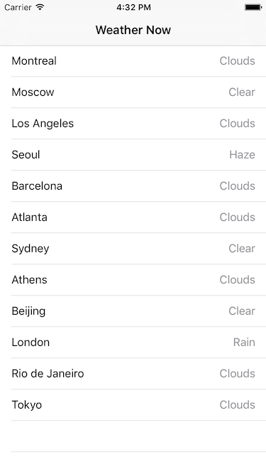

# SwinjectSimpleExample

This is an example project to demonstrate [dependency injection](https://en.wikipedia.org/wiki/Dependency_injection) and [Swinject](https://github.com/Swinject/Swinject) in a simple weather app that lists current weather information at some locations.

## Requirements

- Xcode 7 beta 6
- [CocoaPods](https://cocoapods.org) 0.38 or later

## Installation

1. Download the source code or clone the repository.
2. Run `pod install`.
3. Get a free API key from [OpenWeatherMap](http://openweathermap.org).
4. Open `OpenWeatherMap.swift` and fill `apiKey = ""` with your own API key.

## Blog Post

The following blog post demonstrates step-by-step development of this project introducing dependency injection and Swinject.

- [Dependency Injection Framework for Swift - Simple Weather App Example with Swinject Part 1/2](https://yoichitgy.github.io/post/dependency-injection-framework-for-swift-simple-weather-app-example-with-swinject-part-1/)
- [Dependency Injection Framework for Swift - Simple Weather App Example with Swinject Part 2/2](https://yoichitgy.github.io/post/dependency-injection-framework-for-swift-simple-weather-app-example-with-swinject-part-2/)

## License

MIT license. See the `LICENSE` file for details.
